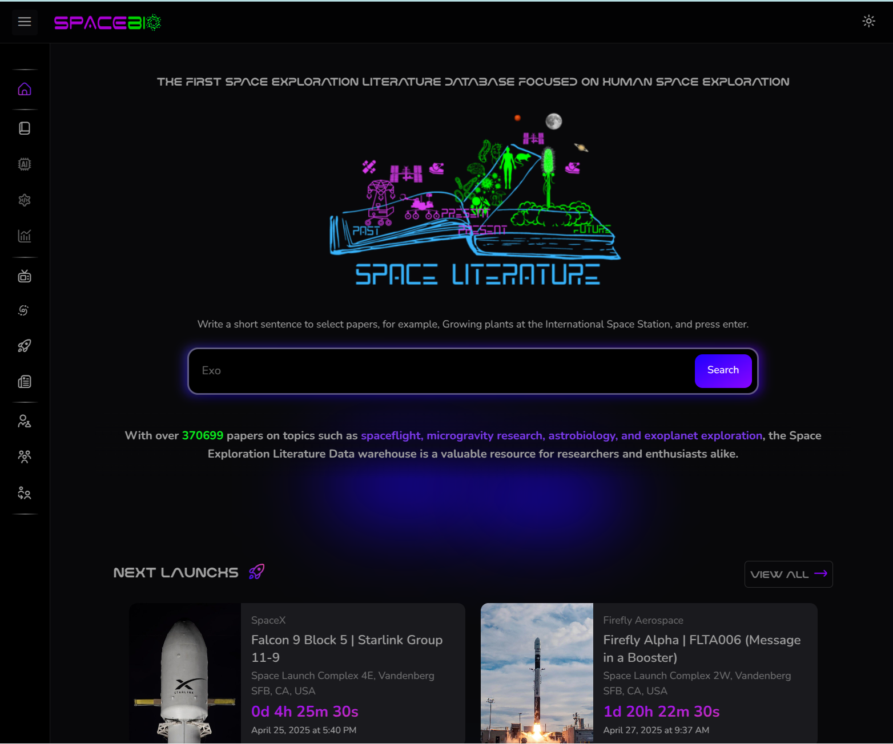

# Summary

SpaceBio addresses the fragmented and rapidly expanding multidisciplinary research landscape in human space exploration, providing a unified platform to streamline access and collaboration. The platform interacts with major scientific literature Application Programming Interfaces (APIs)—including Europe PMC, PubMed, Scopus, Crossref, and Semantic Scholar. Beyond aggregating scientific publications, SpaceBio integrates supplementary data such as rocket launch events, space exploration news, and a virtual telescope interface for global educational engagement. The platform provides a unified (Figure 1), intelligent data warehouse that allows easy and fast retrieval of scientific work, facilitating meta analyzes, identification of key research trends, and generation of hypotheses to guide future experiments in space biology research. SpaceBio is open source and free for educational use, and can be accessed through its web-based platform at <a href="https://spacebio.space" target="_blank">www.spacebio.space</a>.

**Figure 2. User-friendly interface of the SpaceBio platform.** This is the first literature database specifically focused on human space exploration.
To fulfill its mission, SpaceBio is built on a modular, scalable, and production-ready architecture. The backend employs the Model-View-Controller (MVC) pattern using Python’s Django framework and a PostgreSQL relational database, ensuring robust code organization, efficient data processing, and straightforward extensibility.On the frontend, SpaceBio utilizes Tailwind CSS alongside Django templates, embracing a utility-first, component-based design that accelerates development, ensures interface consistency, and minimizes the need for custom styling. This approach enhances maintainability and delivers a cohesive user experience.

# Statement of Need

Human space exploration stands at the intersection of life sciences, physics, engineering, planetary science, and computational methods, making it one of the most multidisciplinary frontiers in modern research [@chatzitheodoridis:2025]. Despite this convergence, researchers face persistent challenges in accessing relevant, high-quality literature due to the fragmented and rapidly expanding body of work across these diverse domains. SpaceBio directly addresses this gap by providing a unified, intelligent data warehouse tailored for human space exploration studies, with a focus on biological and human health research in space environments. The platform empowers scientists to efficiently discover prior work, analyze knowledge trends, and generate hypotheses to guide future missions and experiments in microgravity and extraterrestrial settings.

The data warehouse is populated through an automated pipeline featuring a custom web crawler and data retrieval modules. These interact with major scientific literature APIs—including Europe PMC [@ferguson2021europe], PubMed [@white2020pubmed], Scopus [@burnham2006scopus], Crossref [hendricks2020crossref], and Semantic Scholar[@kinney2023semantic]—using carefully curated keyword queries and adhering to API rate limits to guarantee both relevance and compliance. Beyond aggregating scientific publications, SpaceBio integrates supplementary data such as rocket launch events, space exploration news, and a virtual telescope interface for global educational engagement. This positions SpaceBio not only as a vital research tool, but also as a dynamic platform for teaching and public outreach, supporting both the scientific community and broader audiences interested in the future of human space exploration

# Implementation 

The www.spacebio.space literature database backend modules were implemented using an MVC (Model-View-Controller) software architecture pattern [@garcia2023mvc], programmed in the python programming language using Django framework [@thakur2023django] and with PostgreSQL server relational databases [@salunke2024performance].

The front-end implementation using Tailwind CSS (www.tailwindcss.com) in conjunction with Django framework templates, adhering to a modular and reusable design philosophy. This approach emphasized the componentization of user interfaces, to a cohesive and scalable design system. Tailwind's utility-first classes significantly accelerated development, minimizing the need for custom CSS and streamlining code maintenance. The synergy between Tailwind and Django templates improved overall performance and developer productivity. 

**Figure 1. Conceptual map of the SpaceBio Hub Platform architecture and ecosystem.** The back-end components (green) encompass robust data ingestion pipelines a comprehensive database layer for organizing scientific content, and an API gateway that facilitates seamless system integration. The front-end modules (orange) deliver interactive features including search, advanced data visualization dashboards, and detailed molecular profile pages to enhance user engagement. The SpaceBio community space (pink) is designed to foster collaboration through project showcases, discussion forums, and user-contributed content. Modules currently under development (gray) include a planned multi-omics integration layer, an AI-driven literature summarization tool, and a knowledge graph generator, all of which are being designed to accelerate discovery in space biosciences.

# Functionality

SpaceBio is a modular, scalable Python platform that integrates open-source technologies to retrieve, process, classify, and serve scientific and space-related data. Its architecture supports easy extension with new data sources, machine learning models, and domain-specific ontologies.

Key features:

  * Automated Literature Retrieval: A custom web crawler and ingestion modules connect to databases like Europe PMC, PubMed, Scopus, Crossref, and Semantic Scholar. Curated keyword strategies maximize precision and relevance, while API rate limits and data policies are respected.

  * Real-Time Space Event Tracking: Integration with APIs such as Spaceflight News and The Space Devs provides structured data on missions, rockets, launch sites, agencies, and status updates, contextualizing literature with up-to-date exploration data.

  * Intelligent Search Interface: A user-friendly web interface enables natural language, tag-based, and keyword-based queries (e.g., "plants on the ISS," "microgravity effects on the cardiovascular system"), streamlining interdisciplinary research access.

  * Semantic Enrichment and Topic Categorization: AI-driven classification organizes content into thematic domains, improving discovery of relevant publications and research trends.

  * Educational Integration and Outreach: Built-in virtual telescope and educational modules make SpaceBio accessible for interactive learning by teachers and students worldwide.

  * Export and Interoperability: Search results are exportable for meta-analyses, systematic reviews, and citation tracking, supporting reproducible research.

  * Continuous Updates: Regular synchronization with all connected sources ensures users access the latest scientific findings.

# Acknowledgements
We acknowledge the SpaceBio Community. We acknowledge contributions from Eliab Venacio and Rubens O. Moraes (https://github.com/rubensolv)

# References
